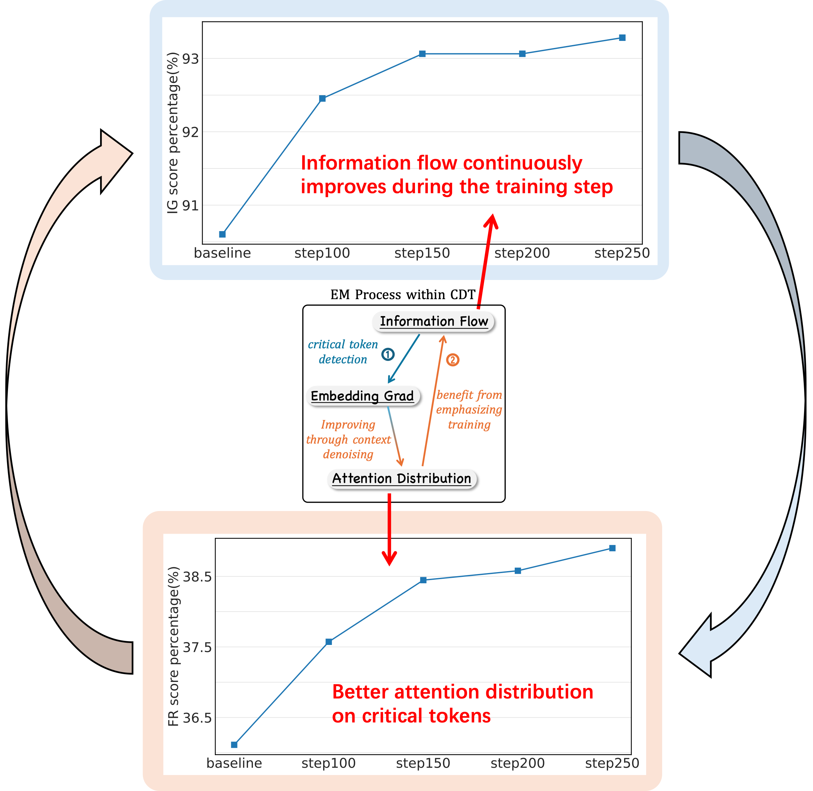
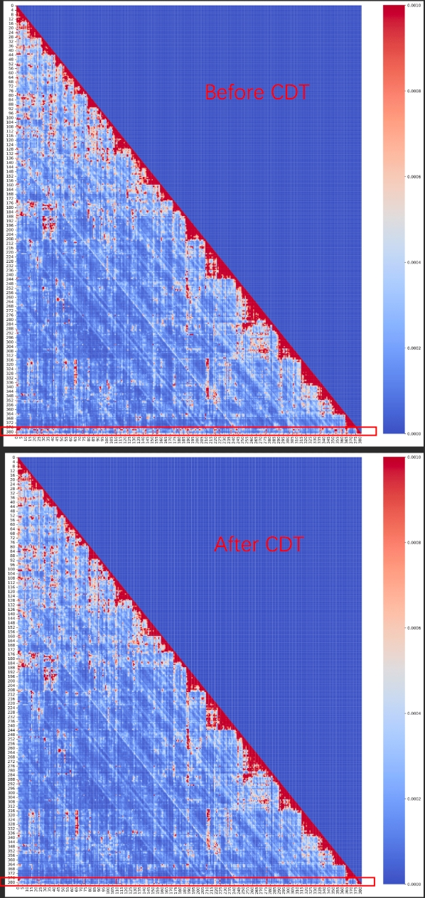

# News: rebuttal update

Since OpenReview does not support image uploads to visualize our results, we provide some visualizations here.  


## **Reviewer 383A [Weakness 2]**: *No empirical evidence demonstrating the benefit of CDT's EM process.*  

We analyze intermediate model checkpoints stored during training and visualized how **information flow and attention distribution** evolve as training progresses. 
Our results demonstrate a clear improvement over time, showcasing how the **Expectation-Maximization (EM) process** refines the model’s ability to detects noise based on information flow and improves the training by diminishing the noise, thereby enhancing the information flow.


*Note*: We measure the proportion of key token gradients (including evidence and attack tokens) relative to the total gradient distribution. Specifically, we compute the average gradient magnitude for key positions and divide it by the sum of the average gradient magnitudes for both key positions and other positions. This percentage reflects how CDT progressively shifts the model’s focus toward critical tokens while reducing the influence of noisy tokens.


## **Reviewer sY5g [Weakness 1]**: *Visualization of attention map before and after CDT.*

Given the long sequence length in our evaluation, we used a test dataset with a sequence length of 12K, which we evenly divided into 380 chunks. For each chunk, we computed the average attention similarity across chunks to analyze the attention distribution.
Below, we provide two attention maps comparing models before and after applying CDT, both taken from the 24th layer of the model, as this layer offers a clearer visualization of CDT’s effect. 

*Due to the large size of the image file (1.7MB per image), it cannot be displayed on the current page. Therefore, please click on the link to jump the files and download them and view it locally!*

- before_cdt.png file: [rebuttal/before_cdt.png](rebuttal/before_cdt.png)
- after_cdt.png file: [rebuttal/after_cdt.png](rebuttal/after_cdt.png)

We also provide a compressed version of the view, but due to the reduced resolution, it is very blurry. We still recommend that you use the above method to download and view the original image locally.



**Please focus on the red-boxed regions at the bottom.**
The last row represents the model’s attention distribution across the entire sequence, showing how it allocates focus to different chunks (tokens). Before CDT, the model attends to many regions (with red indicating high attention weights). However, after CDT, the model concentrates its attention on only a few critical chunks, demonstrating its ability to filter out noisy information effectively.

# Repos for context-denoising-training

**Environmental Setup**

We recommend using ` transformers4.46.1` to deploy models successfully.

Install required packages by running

```bash
pip install -r requirements.txt

```

**Data Preparation**

We use [pg19-test](https://huggingface.co/datasets/emozilla/pg19-test) dataset in our experiments. You may clone this repo by running

```bash
cd preliminary/data
git clone https://huggingface.co/datasets/emozilla/pg19-test

```

## Preliminary

We generate data from source data when testing.

You may also use the full data, and we provide part of it:  **preliminary/data/full20.jsonl**

Our recommendation is to get results with method where data generated online by running

```bash
cd ../..
python preliminary/src/test_score.py --model=meta-llama/Meta-Llama-3.1-8B-Instruct --context_lengths=11900
```

**[Note]**

**At least 8 GPUs with more than 85G memory of each are required to run it successfully.**

Calculate and visualize the IG / FR score of the generated results by running

```bash
python preliminary/src/stats_igscore.py --context_length=11900
python preliminary/src/stats_frscore.py --context_length=11900
```
