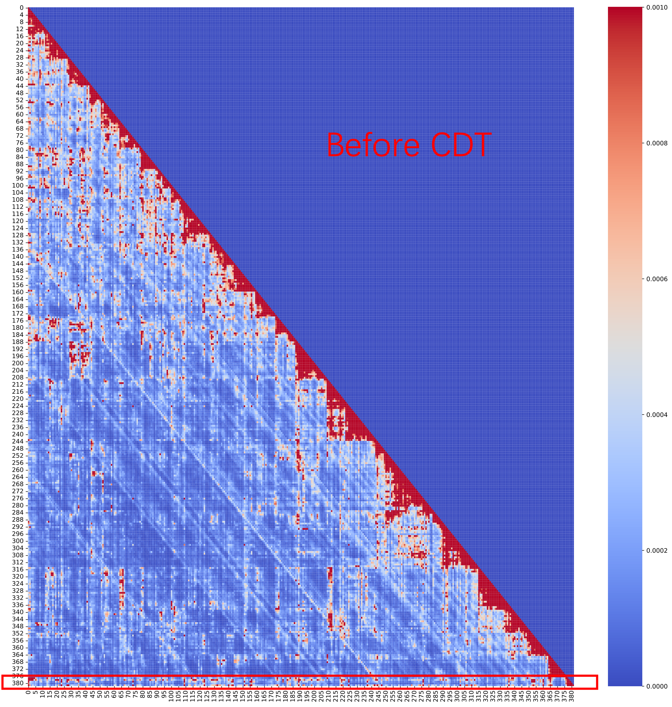
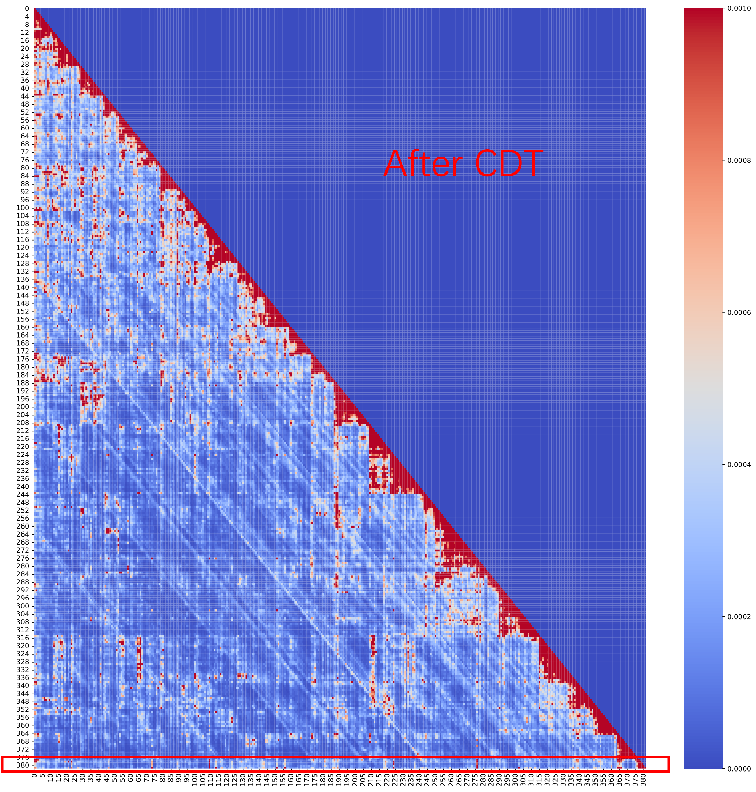

## **Reviewer sY5g [Weakness 1]**: *Visualization of attention map before and after CDT.*

Given the long sequence length in our evaluation, we used a test dataset with a sequence length of 12K, which we evenly divided into 380 chunks. For each chunk, we computed the average attention similarity across chunks to analyze the attention distribution.
Below, we provide two attention maps comparing models before and after applying CDT, both taken from the 24th layer of the model, as this layer offers a clearer visualization of CDT’s effect.

Image too large to display...

**Please focus on the red-boxed regions at the bottom.**
The last row represents the model’s attention distribution across the entire sequence, showing how it allocates focus to different chunks (tokens). Before CDT, the model attends to many regions (with red indicating high attention weights). However, after CDT, the model concentrates its attention on only a few critical chunks, demonstrating its ability to filter out noisy information effectively.
